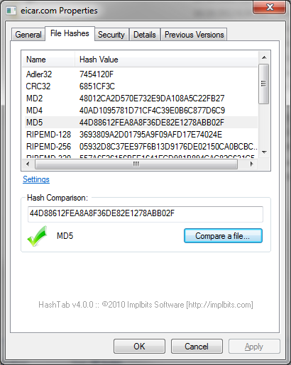
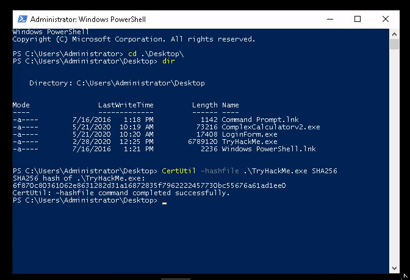
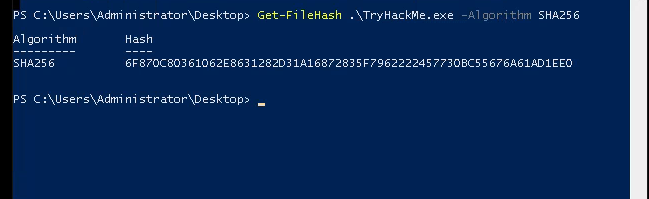

# Calculating Files Hash value
  - # Windows OS
    - ## Using third party applications
      - Hashtab
        - 
    - ## Powershell
      - **CertUtil command**
      
      ```
       CertUtil -hashfile .\TryHackMe.exe SHA256
       
       CertUtil -hashfile <filename> <algorithm>
       
      ```
      
      
      - **Get-FileHash command**

      ```
        Get-FileHash .\Wannacry.exe -Algorithm MD5

        Get-FileHash <filename> -Algorithm <algorithm>
       ```        
         
          
          
          
## Resources and Reading
- [A Meaningful MD5 Hash Collision Attack](https://scholarworks.sjsu.edu/cgi/viewcontent.cgi?referer=https://www.google.com/&httpsredir=1&article=1020&context=etd_projects)
- [A Meaningful MD5 Hash Collision Attack](https://dl.acm.org/doi/book/10.5555/1209579)
- 
