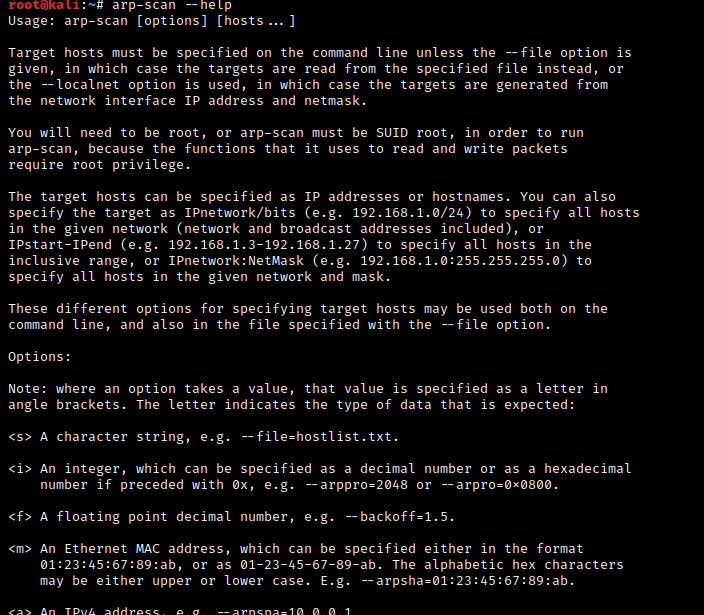

# Host Discovery
  - ## Check list of hosts nmap will scan
    ```nmap -sL TARGETS```
    **Example using range of hosts**
    ```nmap -sL -n 10.10.0-255.101-125``` will give the below output

      

   *This option will gives a detailed list of the hosts that Nmap will scan without scanning them*
  
  - ### Discover online hosts without port-scanning the live systems
    ```
    nmap -sn TARGETS
    ```
 
  - ## ARP Scanning
    - ARP scan is possible only if you are on the same subnet as the target systems. On an Ethernet (802.3) and WiFi (802.11), you need to know the MAC address of any system before you can communicate with it. 
    ```
    nmap -PR -sn TARGETS  
    ```
    *where -PR indicates that only ARP scan should be perform*
    
      
    
  - ### arp-scan
    - ***This is the scanner built around ARP Queries<br> it provides many options to customize your scan.***
    ```
    apt install arp-scan
    ```
    ```
    arp-scan --help
    ```
    
    
  - ## ICMP 
  
   - #### ICMP Echo to discover live hosts
  ```
  nmap -PE -sn TARGET
  ```
   - #### ICMP Timestamp to discover live hosts
  ```
  nmap -PP -sn TARGET
  ```
   - #### ICMP Address Mask to discover live hosts
  ```
  nmap -PM -sn TARGET
  ```
 
  ## Using Reverse-DNS Lookup
   - Nmap’s default behaviour is to use reverse-DNS online hosts. Because the hostnames can reveal a lot, this can be a helpful step. However, if you don’t want to send such DNS queries, you use `-n` to skip this step.

   - By default, Nmap will look up online hosts; however, you can use the option `-R` to query the DNS server even for offline hosts. If you want to use a specific DNS server, you can add the `--dns-servers DNS_SERVER` option.

# Port Scanning
- ### Nmap port states
  - Open
  - Closed
  - Filtered
  - Unfiltered
  - Open|Filtered
  - Close|Filtered
  
 - ## TCP Connect Scan
    - Any open TCP port will require Nmap to complete the TCP 3-way handshake before closing the connection
      ```
      nmap -sT TARGET
      ```
      
 


   <br>scanning with `-F` enable fast mode and `-r` option scan the ports i consecutive order instead of random order.<br>
    ***Unprivileged users are limited to connect scan***
 
 - ## SYN Scan
     - SYN scan `-sS` does not need to complete the TCP 3-way handshake; instead, Nmap sends an RST packet once a SYN/ACK packet is received.
     ```
     nmap -sS TARGET
     ```
      ***This requires privilege/sudo right***

   -TCP SYN scan is the default scan mode when running Nmap as a privileged user 

- ## UDP Scan
   - UDP is a connectionless protocol, and hence it does not require any handshake for connection establishment. We cannot guarantee that a service listening on a UDP port would respond to our packets. However, if a UDP packet is sent to a closed port, an ICMP port unreachable error (type 3, code 3) is returned. 
  ```
  nmap -sU TARGET  
  ```
  
  
  
  
  
 - ## Scan enhancement/fine-tunning
    - **Port list:** `-p22,80,443`
    - **Port range:** `-p1-1023` range is inclusive
    - **All 65535 ports:** `-p-`
    - **top 10 most common ports:** `--top-ports 10`
    - **Control scan timing:** `-T<0-5>` 
      - paranoid (0)
      - sneaky (1)
      - polite (2)
      - normal (3)
      - aggressive (4)
      - insane (5)
    - **control the packet rate:** `--min-rate <number>` and `--max-rate <number>` e.g `--max-rate 10` or `--max-rate=10`
    - **control probing parallelization:** `--min-parallelism <numprobes>` and `--max-parallelism <numprobes` e.g `--min-parallelism=512`
    
 - ## Null Scan
    ```
    nmap -sN TARGET
    ```
    
   - The null scan does not set any flag; all six flag bits are set to zero.
   - A TCP packet with no flags set will not trigger any response when it reaches an open port, therefore, from Nmap’s perspective, a lack of reply in a null scan indicates that either the port is open or a firewall is blocking the packet. 
   
   
   - <br>However, we expect the target server to respond with an RST packet if the port is closed.
   
   
 - ## FIN Scan
    ```
    nmap -sF TARGET
    ```
    
    - The FIN scan sends a TCP packet with the FIN flag set. 
    - no response will be sent if the TCP port is open.
  

   - target system should respond with an RST if the port is closed
  

 - ## Xmas Scan
    ```
    nmap -sX TARGET
    ```
    
    - An Xmas scan sets the FIN, PSH, and URG flags simultaneously
    -  if an RST packet is received, it means that the port is closed. Otherwise, it will be reported as open|filtered.
    
    

  - ## Maimon Scan
      ```
      nmap -sM TARGET
      ```
      - the FIN and ACK bits are set. 
      - The target should send an RST packet as a response. However, certain BSD-derived systems drop the packet if it is an open port exposing the open ports.
      - **Most target systems respond with an RST packet regardless of whether the TCP port is open. In such a case, we won’t be able to discover the open ports.**
      -
      
      
      
      - The console output below is an example of a TCP Maimon scan against a Linux server. As mentioned, because open ports and closed ports are behaving the same way, the Maimon scan could not discover any open ports on the target system.
      -
      


 - ## TCP ACK Scan
  ```
  nmap -sA TARGET
  ```
   - the target would respond to the ACK with RST regardless of the state of the port.
   - Hence, this scan won’t tell us whether the target port is open in a simple setup.
   

   - This kind of scan would be helpful if there is a firewall in front of the target. 
   - Consequently, based on which ACK packets resulted in responses, you will learn which ports were not blocked by the firewall. ***In other words, this type of scan is more suitable to discover firewall rule sets and configuration***<br>
   - ***it is essential to note that the ACK scan and the window scan were very efficient at helping us map out the firewall rules. However, it is vital to remember that just because a firewall is not blocking a specific port, it does not necessarily mean that a service is listening on that port.***
 
 - ## Window Scan
    ```
    nmap -sW TARGET
    ```
    - The TCP window scan is almost the same as the ACK scan; however, it examines the TCP Window field of the RST packets returned. 
    
    

    - Launching a TCP window scan against a Linux system with no firewall will not provide much information
    - the console output shown below, the TCP window scan pointed that three ports are detected as closed. 
    - Although we know that these three ports are not closed, we realize they responded differently, indicating that the firewall does not block them.
    
    
 
 - ## Custom Scan
    ```
    nmap --scanflags RSTSYNFIN
    ```
    
    - we can experiment with a new TCP flag combination beyond the built-in TCP scan types, you can do so using `--scanflags`
      


  - ## Spoofing and Decoys
      - In some network setups, you will be able to scan a target system using a spoofed IP address and even a spoofed MAC address. Such a scan is only beneficial in a situation where you can guarantee to capture the response.
      ```
      nmap -S SPOOFED_IP TARGET
      ```
      - Nmap will craft all the packets using the provided source IP address `SPOOFED_IP`
      - The target machine will respond to the incoming packets sending the replies to the destination IP address `SPOOFED_IP`
      

      - In brief, scanning with a spoofed IP address is three steps:
        - Attacker sends a packet with a spoofed source IP address to the target machine.
        - Target machine replies to the spoofed IP address as the destination.
        - Attacker captures the replies to figure out open ports
      ```
      nmap --spoof-mac SPOOFED_MAC TARGET
      ```
      - When you are on the same subnet as the target machine, you would be able to spoof your MAC address as well.
      
      - **attacker might resort to using decoys to make it more challenging to be pinpointed by make the scan appears to be coming from many IP addresses so that the attacker’s IP address would be lost among them.**
      
      ```
      nmap -D DECOY1, DECOY2, ME TARGET
      ```
      

      - You can launch a decoy scan by specifying a specific or random IP address after -D. For example, `nmap -D 10.10.0.1,10.10.0.2,ME 10.10.161.106` will make the scan of 10.10.161.106 appear as coming from the IP addresses 10.10.0.1, 10.10.0.2, and then `ME` to indicate that your IP address should appear in the third order. Another example command would be `nmap -D 10.10.0.1,10.10.0.2,RND,RND,ME 10.10.161.106` , where the third and fourth source IP addresses are assigned randomly, while the fifth source is going to be the attacker’s IP address. In other words, each time you execute the latter command, you would expect two new random IP addresses to be the third and fourth decoy sources.


    
# References and Reading
  - [TryHackMe Nmap Live Host Discovery Room](https://tryhackme.com/room/nmap01)
  -  [THM Nmap Basic Port Scans Room](Nmap Basic Port Scans)
  -  [Well Known Ports](http://www.vmaxx.net/techinfo/ports.htm)
