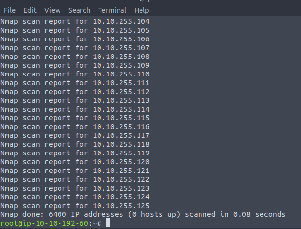

# Host Discovery
  - ## Check list of hosts nmap will scan
    ```nmap -sL TARGETS```
    **Example using range of hosts**
    ```nmap -sL -n 10.10.0-255.101-125``` will give the below output

      

   *This option will gives a detailed list of the hosts that Nmap will scan without scanning them*
  
  - ### Discover online hosts without port-scanning the live systems
    ```
    nmap -sn TARGETS
    ```
 
  - ## ARP Scanning
    - ARP scan is possible only if you are on the same subnet as the target systems. On an Ethernet (802.3) and WiFi (802.11), you need to know the MAC address of any system before you can communicate with it. 
    ```
    nmap -PR -sn TARGETS  
    ```
    *where -PR indicates that only ARP scan should be perform*
    
      
    
  - ### arp-scan
    - ***This is the scanner built around ARP Queries<br> it provides many options to customize your scan.***
    ```
    apt install arp-scan
    ```
    ```
    arp-scan --help
    ```
    
    
  - ### ICMP 
  - 
   - #### ICMP Echo to discover live hosts
  ```
  nmap -PE -sn TARGET
  ```
   - #### ICMP Timestamp to discover live hosts
  ```
  nmap -PP -sn TARGET
  ```
   - #### ICMP Address Mask to discover live hosts
  ```
  nmap -PM -sn TARGET
  ```
  
